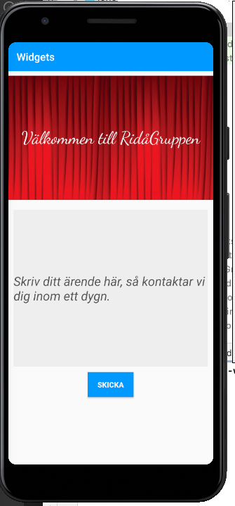

# Dugga 3: Widgets

Först forkades appen widgets på Lenasys Github till a20andlj-sidan på Github. Därefter klonades url:en 
och startades i Android Studio.

Efter lite fram och tillbaka bestämdes det att en contstraint layout skulle användas att placera
widgetarna i. 
```
<androidx.constraintlayout.widget.ConstraintLayout xmlns:android="http://schemas.android.com/apk/res/android"
    xmlns:app="http://schemas.android.com/apk/res-auto"
    xmlns:tools="http://schemas.android.com/tools"
    android:layout_width="match_parent"
    android:layout_height="match_parent"
    tools:context=".MainActivity">
```

Därefter skissades en enkel layout ut för appen på ett papper och utifrån den undersöktes vilka widgetar
som skulle passa för respektive del.

Överst i layouten i XML-filen skapades en imageview som döps till rida2. Efter lite fixande och trixande
och hjälp från handledarna importerades en bilden rida2. Det funkade inte att lägga till en .jpg vilket var konstigt, 
men när bilden gjordes om till .png funkade importen till drawable-mappen i Resource Manager. Det länkades 
till bilden med srcCompat. För att placera widgeterna så användes contraintRight, left m.m. för att placera de.
Detta gjordes dock efter att alla fyra widgetar hade lagts till. En fundering dock är att på exemplet i 
LenaSys så stod det att fyra riktningar måste användas, men i detta fall verkar inte det behövas för att 
få till rätt placering.
```
<ImageView
        android:id="@+id/rida2"
        android:layout_width="match_parent"
        android:layout_height="wrap_content"
        android:contentDescription="Logo"
        app:srcCompat="@drawable/rida2"
        app:layout_constraintRight_toRightOf="parent"
        app:layout_constraintLeft_toLeftOf="parent"
        app:layout_constraintBottom_toTopOf="@+id/my_edit"
        />
```

Sedan lades det till en TextView som skulle innehålla en hälsningsfras för att veta vilken app 
användaren kommit till. Den stylades med en annan fontfamilj plus lite andra detaljer som går att se
i koden nedan. Texten skulle ligga på ridå-bilden och därför placerades den i förhållande till bilden.
```
<TextView
        android:id="@+id/welcome"
        android:layout_width="match_parent"
        android:layout_height="wrap_content"
        android:gravity="center_horizontal"
        android:text="Välkommen till RidåGruppen"
        android:textAlignment="center"
        android:fontFamily="cursive"
        android:textSize="33sp"
        android:textColor="#eee"
        app:layout_constraintStart_toStartOf="@+id/rida2"
        app:layout_constraintEnd_toEndOf="@+id/rida2"
        app:layout_constraintBottom_toBottomOf="@+id/rida2"
        app:layout_constraintTop_toTopOf="@+id/rida2"

```
Under bilden och Textvyn skapades sedan en EditText plus en button. Tanken var att användaren ska 
kunna skriva ett meddelande och skicka till företaget via appen och i sin tur bli kontaktad.
```
   <EditText
        android:id="@+id/my_edit"
        android:layout_width="match_parent"
        android:layout_height="300dp"
        android:layout_margin="10dp"
        android:background="#eee"
        android:hint="Skriv ditt ärende här, så kontaktar vi dig inom ett dygn."
        android:textSize="24sp"
        android:textStyle="italic"
        android:textColorHint="#555"
        app:layout_constraintTop_toBottomOf="@id/rida2"
        app:layout_constraintLeft_toLeftOf="parent"
        app:layout_constraintRight_toRightOf="parent"
        />
```
```
<Button
        android:id="@+id/my_button"
        android:layout_width="wrap_content"
        android:layout_height="wrap_content"
        android:background="#09f"
        android:text="Skicka"
        android:textColor="#eee"
        android:layout_margin="10dp"
        app:layout_constraintTop_toBottomOf="@+id/my_edit"
        app:layout_constraintRight_toRightOf="parent"
        app:layout_constraintLeft_toLeftOf="parent"
        android:textStyle="bold"
        />
```

I java-koden aktiverades skicka-knappen så att den svarar på tryck. Den lades till en log.d med en tag och meddelande så att ska 
synas i logcaten om knappen fungerar.
```
@Override
    protected void onCreate(Bundle savedInstanceState) {
        super.onCreate(savedInstanceState);
        setContentView(R.layout.activity_main);

        Button button = findViewById(R.id.my_button);

        button.setOnClickListener(new View.OnClickListener() {
            @Override
            public void onClick(View v) {
                Log.d("==>", "Tryckt skicka: ");
            }
        });
    }
```

Här är resultatet via en screenshot på appen.



